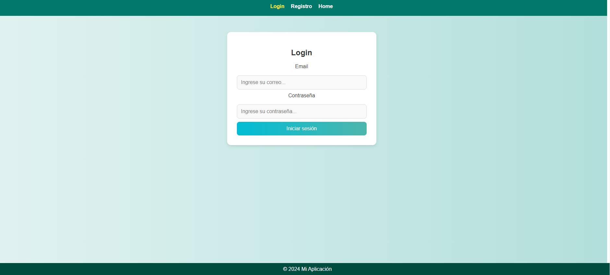
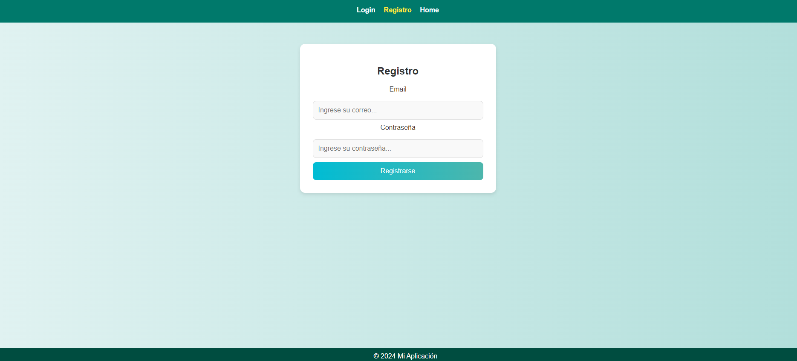
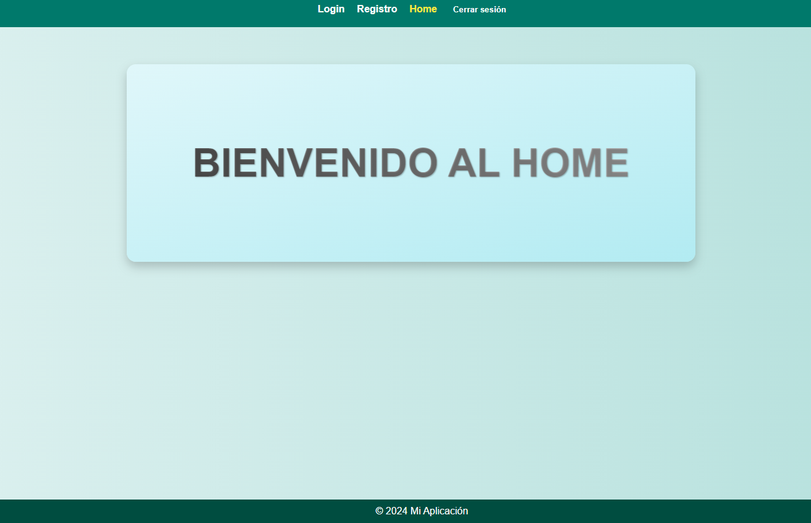
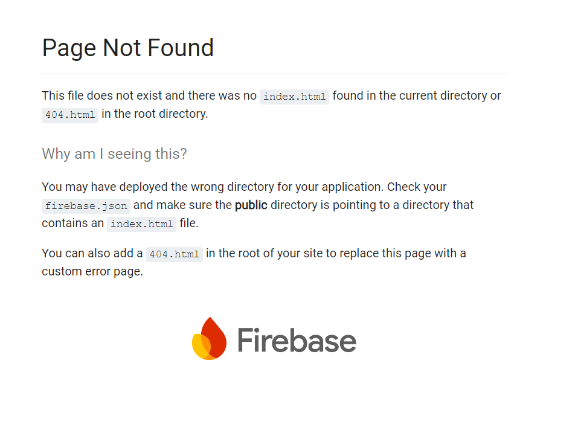

Desarrolladora Ana Celeste Pérez.

# Proyecto Vue.js con Firebase

Este proyecto es una aplicación web construida con Vue.js y Firebase. La aplicación permite a los usuarios registrarse y autenticarse utilizando Firebase Authentication y tiene una interfaz de usuario moderna. Es una aplicación sencilla, sin muchos detalles, muy basica y sencilla (registro por ejemplo, home, login), la idea es tener una base y se pueda modificar según sea el caso

## Descripción

La aplicación incluye:
- Registro de usuarios.
- Inicio de sesión.
- Mensajes de éxito y error.
- Estilos modernos con colores turquesa y gris.

## Requisitos

- Node.js y npm (Node Package Manager).
- Vue CLI.
- Firebase CLI (para el despliegue).

## Instalación

1. **Clona el repositorio:**

    ```bash
    git clone https://github.com/tu-usuario/tu-repositorio.git
    cd tu-repositorio
    ```

2. **Instala las dependencias:**

    ```bash
    npm install
    ```

3. **Configura Firebase:**

    - Crea un proyecto en [Firebase Console](https://console.firebase.google.com/).
    - Configura la autenticación en Firebase y añade los métodos de inicio de sesión deseados (por ejemplo, correo electrónico y contraseña).
    - Copia la configuración de Firebase y guárdala en un archivo `firebaseConfig.js` dentro del directorio `src/config/`. Asegúrate de que el archivo tenga el siguiente contenido:

      ```javascript
      import { initializeApp } from "firebase/app";
      import { getAuth, createUserWithEmailAndPassword, signInWithEmailAndPassword, signOut } from "firebase/auth";

      const firebaseConfig = {
        apiKey: "TU_API_KEY",
        authDomain: "TU_AUTH_DOMAIN",
        projectId: "TU_PROJECT_ID",
        storageBucket: "TU_STORAGE_BUCKET",
        messagingSenderId: "TU_MESSAGING_SENDER_ID",
        appId: "TU_APP_ID"
      };

      const app = initializeApp(firebaseConfig);
      const auth = getAuth(app);

      export { auth, createUserWithEmailAndPassword, signInWithEmailAndPassword, signOut };
      ```

## Ejecución

1. **Ejecuta la aplicación en modo de desarrollo:**

    ```bash
    npm run serve
    ```

    La aplicación estará disponible en [https://crearproyecto-50152.web.app](https://crearproyecto-50152.web.app)


2. **Compila la aplicación para producción:**

    ```bash
    npm run build
    ```

    Los archivos compilados se guardarán en el directorio `dist`.

## Despliegue

1. **Instala Firebase CLI si no lo has hecho:**

    ```bash
    npm install -g firebase-tools
    ```

2. **Autentica con Firebase:**

    ```bash
    firebase login
    ```

3. **Configura Firebase en tu proyecto:**

    ```bash
    firebase init
    ```

    - Selecciona "Hosting".
    - Configura el directorio público como `dist`.
    - Configura como una SPA (single-page application) y asegúrate de que las reescrituras estén habilitadas.

4. **Despliega la aplicación:**

    ```bash
    firebase deploy
    ```

## Configuración de `firebase.json`

Asegúrate de que tu archivo `firebase.json` contenga la configuración de reescritura para una SPA:

```json
{
  "hosting": {
    "public": "dist",
    "ignore": [
      "firebase.json",
      "**/.*",
      "**/node_modules/**"
    ],
    "rewrites": [
      {
        "source": "**",
        "destination": "/index.html"
      }
    ]
  }
}

``` 
---
## Problemas..
Por alguna razón, al iniciar sesión me redirigee al home y al reloguear la pagina sale esta información:

.


